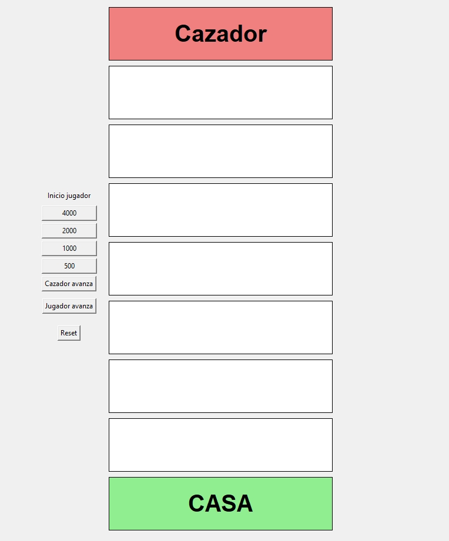
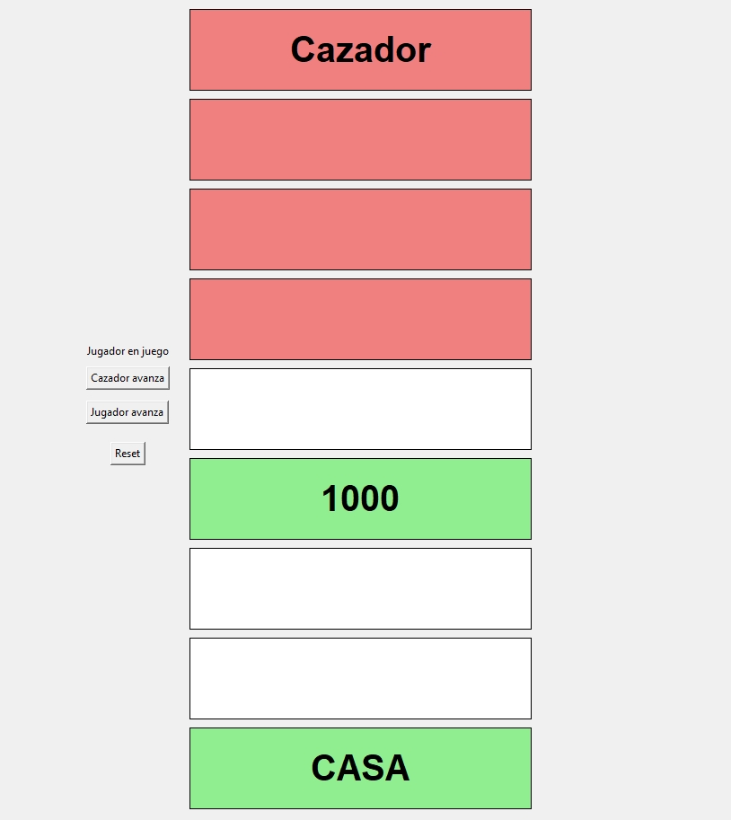

# GatoGafas

GatoGafas es un pequeño proyecto personal para tener una interfaz sencilla para un concurso casero de preguntas y respuestas.

La interfaz imita al que tiene el concurso de televisión española "El Cazador".

## Cómo funciona el concurso

Hay un cazador y un jugador. El objetivo del jugador es avanzar casilla a casilla hasta llegar a CASA. El cazador tratará de atraparle.

Ambos avanzan una casilla si aciertan la pregunta (que no están incorporadas en este programa). Tradicionalmente, la pregunta se muestra con tres posibles respuestas donde sólo una de ellas es la correcta.

Antes de empezar, el jugador debe elegir qué cantidad quiere y, por tanto, en qué fila empieza. En este programa los puntos son: 4000, 2000, 1000 y 500; siguiendo la misma relación que en el programa original donde 1000 sería la cantidad previa conseguida por el jugador y las otras cantidades son multiplicaciones de esa cantidad: x4, x2 y x0.5.

## Cómo usar el programa

La interfaz es muy simple, aunque puede tener bugs si no se usa correctamente.

> [!IMPORTANT]
> Al iniciar el programa, selecciona una de las cuatro posibles cantidades (4000, 2000, 1000, 500).

Después de eso, simplemente ve pulsando los botones "Cazador avanza" y "Jugador avanza" para que vayan avanzando una casilla cada uno de ellos (si aciertan).

Para empezar de nuevo, usa el botón de Reset.

